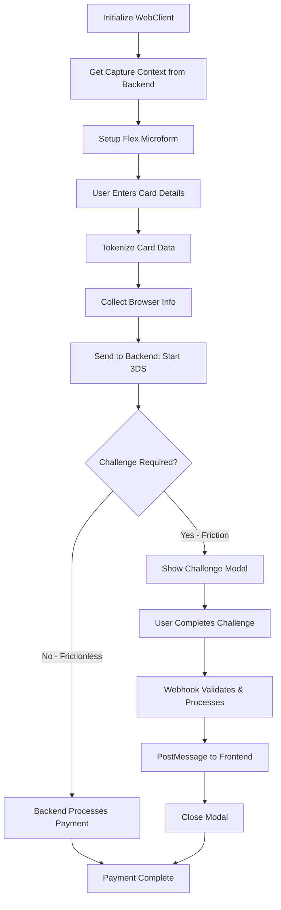

# CyberSource 3DS Web SDK

A lightweight, framework-agnostic JavaScript SDK for handling CyberSource 3D Secure authentication and Flex Microform card collection in the browser.

## Features

- ✅ **Flex Microform** - PCI-compliant card collection (iFrame-based)
- ✅ **Device Data Collection** - Automated fingerprinting for 3DS 2.x
- ✅ **Challenge UI** - Pre-built modal for 3DS step-up authentication
- ✅ **Smart Loading** - Automatic Flex SDK script loading with retry logic
- ✅ **TypeScript First** - Full type definitions for a better developer experience
- ✅ **Framework Agnostic** - Seamlessly integrates with React, Vue, Angular, or Vanilla JS

---

## Installation

```bash
npm install @deskcreate/cybersource-3ds-web
```

---

## 🏗 Payment Flow Overview

Understanding the 3DS payment flow is crucial for proper integration:



### Two Flow Types

#### 1. **Frictionless Flow** (No Challenge)
- Card issuer approves without additional verification
- Backend processes payment immediately after enrollment
- Frontend calls `/complete` endpoint to finalize

#### 2. **Friction Flow** (Challenge Required)
- Card issuer requires additional verification (OTP, biometric, etc.)
- Frontend shows challenge modal (iframe)
- User completes verification with their bank
- **Backend webhook automatically validates and processes payment**
- Webhook sends `postMessage` to frontend with result
- Frontend closes modal and shows success/error

> [!IMPORTANT]
> **For friction flows, the payment is processed automatically by your backend webhook.** The frontend only needs to listen for the completion message via `postMessage`.

---

## Quick Start

### 1. HTML Setup

```html
<!-- Container for the Flex Microform iframes -->
<div id="microform-container"></div>

<!-- Expiry Inputs (Required - Flex v2 only handles card number and CVV) -->
<input type="text" id="expiryMonth" placeholder="MM" maxlength="2" />
<input type="text" id="expiryYear" placeholder="YYYY" maxlength="4" />
```

> **Note:** The SDK automatically loads the Flex Microform script when you call `setupFlexMicroform`. No manual script tag needed.

### 2. Initialize the Client

```javascript
import { WebClient } from '@deskcreate/cybersource-3ds-web'

const client = new WebClient()
```

### 3. Setup Secure Card Input

> [!IMPORTANT]
> **Flex Microform only handles Card Number and CVV.** You MUST collect the Expiry Month and Expiry Year using your own standard HTML inputs.

#### Minimal Setup
```javascript
// Get capture context from your backend
const { captureContext } = await fetch('/api/capture-context').then(r => r.json())

// Setup microform
const flex = await client.setupFlexMicroform('microform-container', captureContext)
```

#### Customized Setup
```javascript
const flex = await client.setupFlexMicroform('microform-container', captureContext, {
  layout: 'stacked', // or 'inline'
  placeholders: {
    cardNumber: '1234 5678 9012 3456',
    securityCode: '•••'
  },
  labels: {
    cardNumber: 'Card Number',
    securityCode: 'CVV'
  },
  customStyles: {
    fontSize: '16px',
    fontFamily: 'system-ui, sans-serif',
    textColor: '#1a1a1a',
    borderColor: '#d1d5db',
    focusBorderColor: '#4f46e5',
    borderRadius: '8px',
    inputHeight: '48px'
  }
})
```

### 4. Process Payment

```javascript
// 1. Tokenize card data
const { token, cardType, maskedPan } = await flex.tokenize(expiryMonth, expiryYear)

// 2. Collect browser information for 3DS
const deviceInfo = await client.collectBrowserInfo()

// 3. Send to your backend to start 3DS enrollment
const { enrollment, transactionId } = await fetch('/api/start', {
  method: 'POST',
  headers: { 'Content-Type': 'application/json' },
  body: JSON.stringify({
    transientToken: token,
    cardType,
    amount: '100.00',
    currency: 'USD',
    deviceInformation: deviceInfo,
    customerInfo: { /* ... */ }
  })
}).then(r => r.json())

// 4. Handle challenge if required
if (enrollment.challengeRequired) {
  // Show challenge modal (non-blocking)
  client.showChallengeModal(
    enrollment.stepUpUrl,
    enrollment.accessToken,
    { transactionId }
  )
  
  // Wait for completion via postMessage
  const result = await waitForChallengeComplete(transactionId)
  
  // Close modal
  client.closeChallengeModal()
  
  if (!result.success) {
    throw new Error(result.error || 'Payment failed')
  }
  
  // Payment already completed by backend webhook!
  console.log('Payment successful:', result.payment)
  
} else {
  // Frictionless - call complete endpoint
  const payment = await fetch('/api/complete', {
    method: 'POST',
    headers: { 'Content-Type': 'application/json' },
    body: JSON.stringify({ transactionId })
  }).then(r => r.json())
  
  console.log('Payment successful:', payment)
}
```

---

## 📖 API Reference

### `WebClient`

Main client class for interacting with CyberSource services.

#### Constructor
```typescript
const client = new WebClient()
```

#### Methods

##### `setupFlexMicroform(containerId, captureContext, options?)`

Sets up secure card input fields in the specified container.

**Parameters:**
- `containerId` (string, required) - DOM element ID where fields will be rendered
- `captureContext` (string, required) - JWT from your backend's capture context API
- `options` (object, optional):
  - `layout?: 'stacked' | 'inline'` - Field layout (default: 'stacked')
  - `placeholders?: { cardNumber?: string, securityCode?: string }`
  - `labels?: { cardNumber?: string, securityCode?: string }`
  - `customStyles?: FlexFieldStyles` - Custom styling options
  - `onFieldChange?: (fieldType: string, data: FlexFieldChangeData) => void`

**Returns:** `Promise<FlexMicroformInstance>`

**Example:**
```javascript
const flex = await client.setupFlexMicroform('card-container', captureContext, {
  layout: 'inline',
  customStyles: {
    fontSize: '16px',
    borderRadius: '8px'
  }
})
```

---

##### `collectBrowserInfo(ipAddress?)`

Collects browser fingerprint data for 3DS authentication.

**Parameters:**
- `ipAddress` (string, optional) - Client's public IP address

**Returns:** `Promise<DeviceInformation>`

**Recommended:** Use this method instead of `collectDeviceData` for simpler integration.

**Example:**
```javascript
const deviceInfo = await client.collectBrowserInfo()
```

---

##### `collectDeviceData(deviceDataUrl, accessToken, options?)`

Legacy method for device data collection using hidden iframe.

**Parameters:**
- `deviceDataUrl` (string, required) - Device data collection URL from CyberSource
- `accessToken` (string, required) - Access token from CyberSource
- `options` (object, optional):
  - `timeoutMs?: number` - Timeout in milliseconds (default: 10000)

**Returns:** `Promise<{ success: boolean, timeout?: boolean }>`

---

##### `showChallengeModal(stepUpUrl, accessToken, options?)`

Displays the 3DS challenge modal for user authentication.

**Parameters:**
- `stepUpUrl` (string, required) - Challenge URL from enrollment response
- `accessToken` (string, required) - Access token from enrollment response
- `options` (object, optional):
  - `transactionId?: string` - Transaction ID for matching completion events
  - `timeoutMs?: number` - Modal timeout (default: 600000 / 10 minutes)

**Returns:** `Promise<AuthenticationResult>`

> **Note:** This method is non-blocking. It shows the modal but doesn't wait for completion. Use `postMessage` listener to detect completion.

**Example:**
```javascript
// Show modal (non-blocking)
client.showChallengeModal(stepUpUrl, accessToken, { transactionId })

// Listen for completion separately
window.addEventListener('message', (event) => {
  if (event.data.type === '3DS_COMPLETE' && event.data.transactionId === transactionId) {
    client.closeChallengeModal()
    // Handle result
  }
})
```

---

##### `closeChallengeModal()`

Manually closes the challenge modal.

**Example:**
```javascript
client.closeChallengeModal()
```

---

##### `destroy()`

Cleans up all resources and removes event listeners.

**Example:**
```javascript
client.destroy()
```

---

### `FlexMicroformInstance`

Returned by `setupFlexMicroform()`.

#### Methods

##### `tokenize(expiryMonth, expiryYear)`

Tokenizes the card data entered in the secure fields.

**Parameters:**
- `expiryMonth` (string, required) - 2-digit month (e.g., '06')
- `expiryYear` (string, required) - 4-digit year (e.g., '2029')

**Returns:** `Promise<FlexTokenizeResult>`
```typescript
{
  token: string        // Transient token JWT
  maskedPan: string    // Masked card number (e.g., '411111••••••1111')
  cardType: string     // Card type (e.g., 'visa', 'mastercard')
  expiryMonth: string  // Normalized month
  expiryYear: string   // Normalized year
}
```

**Example:**
```javascript
const { token, cardType, maskedPan } = await flex.tokenize('06', '2029')
```

---

##### `isValid()`

Checks if all fields are valid.

**Returns:** `boolean`

---

##### `destroy()`

Destroys the microform instance and cleans up.

---

## 🚀 Complete React Example

Here's a production-ready React hook implementation:

```typescript
import { useState, useRef, useEffect, useCallback } from 'react'
import { WebClient, type FlexMicroformInstance } from '@deskcreate/cybersource-3ds-web'

interface PaymentCompleteMessage {
  type: '3DS_COMPLETE'
  transactionId: string
  success: boolean
  payment?: {
    id: string
    status: string
    amount: number
    currency: string
  }
  error?: string
}

export const useCheckout = () => {
  const [status, setStatus] = useState<'IDLE' | 'INITIALIZING' | 'READY' | 'PROCESSING' | 'CHALLENGING' | 'SUCCESS' | 'ERROR'>('IDLE')
  const [message, setMessage] = useState('')
  const [error, setError] = useState<Error | null>(null)
  const [result, setResult] = useState<any>(null)

  const clientRef = useRef<WebClient | null>(null)
  const microformRef = useRef<FlexMicroformInstance | null>(null)
  const challengeResolveRef = useRef<((result: PaymentCompleteMessage) => void) | null>(null)
  const currentTransactionIdRef = useRef<string | null>(null)

  // Listen for challenge completion messages
  useEffect(() => {
    const handleMessage = (event: MessageEvent) => {
      const data = event.data as PaymentCompleteMessage

      if (!data || data.type !== '3DS_COMPLETE') return

      // Verify transaction ID matches
      if (currentTransactionIdRef.current && data.transactionId !== currentTransactionIdRef.current) {
        return
      }

      // Resolve the challenge promise
      if (challengeResolveRef.current) {
        challengeResolveRef.current(data)
        challengeResolveRef.current = null
      }
    }

    window.addEventListener('message', handleMessage)
    return () => window.removeEventListener('message', handleMessage)
  }, [])

  // Initialize microform
  useEffect(() => {
    let isActive = true
    const client = new WebClient()
    clientRef.current = client

    const init = async () => {
      try {
        setStatus('INITIALIZING')
        setMessage('Loading...')

        // Get capture context from your backend
        const { captureContext } = await fetch('/api/capture-context').then(r => r.json())

        if (!isActive) return

        // Setup microform
        const microform = await client.setupFlexMicroform('microform-container', captureContext, {
          layout: 'stacked',
          customStyles: {
            fontSize: '16px',
            borderRadius: '8px'
          }
        })

        if (!isActive) {
          microform.destroy()
          return
        }

        microformRef.current = microform
        setStatus('READY')
        setMessage('Ready to pay')
      } catch (err: any) {
        if (!isActive) return
        setStatus('ERROR')
        setMessage(err.message || 'Failed to initialize')
        setError(err)
      }
    }

    init()

    return () => {
      isActive = false
      microformRef.current?.destroy()
      clientRef.current?.destroy()
    }
  }, [])

  // Wait for challenge completion
  const waitForChallengeComplete = useCallback((transactionId: string): Promise<PaymentCompleteMessage> => {
    return new Promise((resolve, reject) => {
      currentTransactionIdRef.current = transactionId
      challengeResolveRef.current = resolve

      // Timeout after 10 minutes
      const timeout = setTimeout(() => {
        if (challengeResolveRef.current) {
          challengeResolveRef.current = null
          reject(new Error('Challenge timed out'))
        }
      }, 600000)

      // Clear timeout on resolve
      const originalResolve = challengeResolveRef.current
      challengeResolveRef.current = (result) => {
        clearTimeout(timeout)
        originalResolve(result)
      }
    })
  }, [])

  // Payment function
  const pay = useCallback(async (amount: string, currency: string, expiryMonth: string, expiryYear: string) => {
    const microform = microformRef.current
    const client = clientRef.current

    if (!microform || !client) {
      setStatus('ERROR')
      setMessage('Payment form not ready')
      return
    }

    try {
      // 1. Tokenize
      setStatus('PROCESSING')
      setMessage('Securing card...')

      const { token, cardType } = await microform.tokenize(expiryMonth, expiryYear)

      // 2. Collect device info
      const deviceInfo = await client.collectBrowserInfo()

      // 3. Start 3DS
      setMessage('Verifying card...')

      const response = await fetch('/api/start', {
        method: 'POST',
        headers: { 'Content-Type': 'application/json' },
        body: JSON.stringify({
          transientToken: token,
          cardType,
          amount,
          currency,
          deviceInformation: deviceInfo
        })
      }).then(r => r.json())

      const { enrollment, transactionId } = response

      // 4. Handle challenge if required
      if (enrollment.challengeRequired) {
        setStatus('CHALLENGING')
        setMessage('Verify your identity...')

        // Show modal
        client.showChallengeModal(enrollment.stepUpUrl, enrollment.accessToken, { transactionId })

        // Wait for completion
        const result = await waitForChallengeComplete(transactionId)

        // Close modal
        client.closeChallengeModal()

        if (!result.success) {
          throw new Error(result.error || 'Payment failed')
        }

        // Payment completed by backend
        setStatus('SUCCESS')
        setMessage('Payment successful!')
        setResult(result.payment)
      } else {
        // Frictionless flow
        setMessage('Processing payment...')

        const payment = await fetch('/api/complete', {
          method: 'POST',
          headers: { 'Content-Type': 'application/json' },
          body: JSON.stringify({ transactionId })
        }).then(r => r.json())

        setStatus('SUCCESS')
        setMessage('Payment successful!')
        setResult(payment)
      }
    } catch (err: any) {
      clientRef.current?.closeChallengeModal()
      setStatus('ERROR')
      setMessage(err.message || 'Payment failed')
      setError(err)
    }
  }, [waitForChallengeComplete])

  return {
    status,
    message,
    error,
    result,
    pay,
    isReady: status === 'READY',
    isLoading: ['INITIALIZING', 'PROCESSING', 'CHALLENGING'].includes(status)
  }
}
```

**Usage:**
```tsx
function CheckoutForm() {
  const { status, message, pay, isReady } = useCheckout()
  const [expiry, setExpiry] = useState({ month: '06', year: '2029' })

  return (
    <div>
      <div id="microform-container"></div>
      
      <input 
        value={expiry.month} 
        onChange={e => setExpiry({ ...expiry, month: e.target.value })}
        placeholder="MM"
      />
      <input 
        value={expiry.year}
        onChange={e => setExpiry({ ...expiry, year: e.target.value })}
        placeholder="YYYY"
      />
      
      <button 
        onClick={() => pay('100.00', 'USD', expiry.month, expiry.year)}
        disabled={!isReady}
      >
        {status === 'PROCESSING' ? message : 'Pay $100.00'}
      </button>
    </div>
  )
}
```

---

## 🔧 Backend Integration

Your backend needs three endpoints:

### 1. Generate Capture Context
```javascript
POST /api/capture-context
Body: { targetOrigins: ['https://yoursite.com'] }
Response: { captureContext: 'eyJraWQ...' }
```

### 2. Start 3DS Enrollment
```javascript
POST /api/start
Body: {
  transientToken: string
  cardType: string
  amount: string
  currency: string
  deviceInformation: object
  customerInfo: object
}
Response: {
  transactionId: string
  enrollment: {
    challengeRequired: boolean
    stepUpUrl?: string
    accessToken?: string
  }
}
```

### 3. Complete Payment (Frictionless)
```javascript
POST /api/complete
Body: { transactionId: string }
Response: { status: 'success', payment: {...} }
```

### 4. Webhook (Friction Flow)
```javascript
POST /api/webhook/3ds?transactionId=xxx&cardType=xxx
Body: { TransactionId: string, ... }
Response: HTML with postMessage script
```

The webhook should:
1. Validate the authentication
2. Process the payment
3. Return HTML that sends a `postMessage` to the parent window:

```html
<script>
  const message = {
    type: '3DS_COMPLETE',
    transactionId: 'xxx',
    success: true,
    payment: { id: 'pay_123', status: 'AUTHORIZED', amount: 100.00, currency: 'USD' }
  }
  
  if (window.parent !== window) window.parent.postMessage(message, '*')
  if (window.opener) window.opener.postMessage(message, '*')
  if (window.top && window.top !== window) window.top.postMessage(message, '*')
</script>
```

---

## 🎨 Styling the Challenge Modal

You can customize the modal appearance:

```javascript
client.setModalStyles({
  overlay: {
    backgroundColor: 'rgba(0, 0, 0, 0.75)'
  },
  modal: {
    borderRadius: '16px',
    boxShadow: '0 20px 60px rgba(0, 0, 0, 0.3)'
  },
  header: {
    background: 'linear-gradient(135deg, #667eea 0%, #764ba2 100%)',
    padding: '24px'
  }
})
```

---

## 🐛 Troubleshooting

### Microform fields not showing
- Ensure the container element exists in the DOM before calling `setupFlexMicroform`
- Check browser console for script loading errors
- Verify the capture context is valid and not expired

### Challenge modal not closing
- Ensure your webhook returns proper HTML with `postMessage` script
- Check that the `transactionId` in the message matches
- Verify the message event listener is set up before showing the modal

### "Flex SDK not available" error
- The SDK automatically loads the Flex script, but network issues can cause failures
- Check your Content Security Policy allows loading from `flex.cybersource.com`
- Try manually including the script tag in your HTML

---

## Contributing
See [CONTRIBUTING.md](CONTRIBUTING.md) for details.

## License
MIT License.
